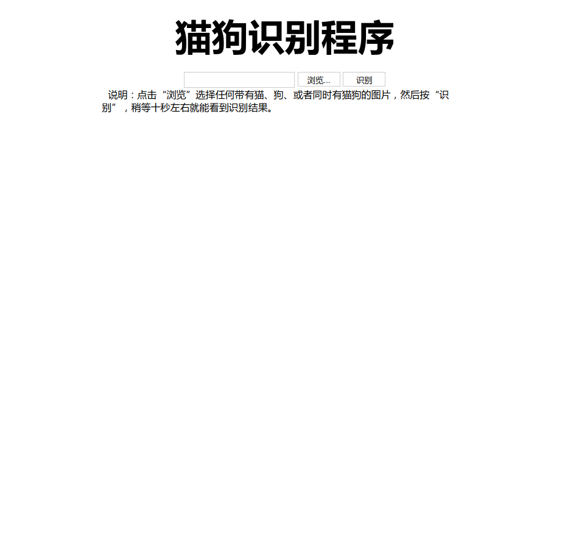
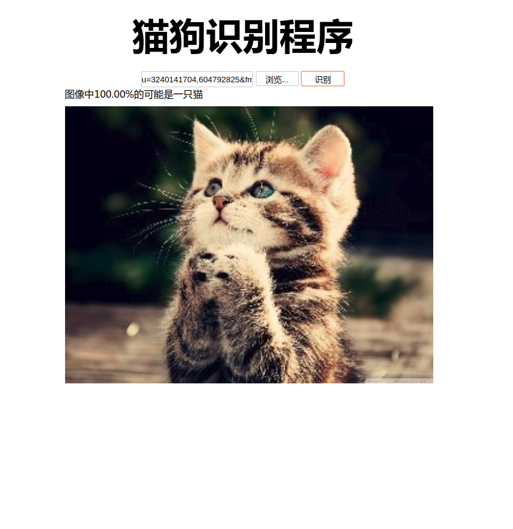

# 猫狗识别应用

本项目为Udacity机器学习课程毕业项目。  

该项目关键难点在于：
- 开题报告以及论文的编写
- 图像原始数据的处理（异常检测、数据增强、图像尺寸标准化）
- 基于多个成熟CNN模型的模型融合 
- 分类器的训练 
- 对预测值的处理

  
## 目录结构说明
```bash
├── app      # 应用部署包
│   ├── model   # 预训练CNN模型
│   ├── static  # 静态资源文件
│   ├── templates   # App网页入口
│   ├── cnn_model.py # 融合模型
│   └── webapp.py    # 前端控制器
│
└── submission # 项目过程文档

```

## 如何运行

### 安装Anaconda,Tensorflow与Keras  
具体安装方法请自行百度。

### 创建运行环境
```bash
$ conda create -n py36 python=3.6 
```
### 切换运行环境
```bash
$ source activate py36
```
### 安装依赖项
```bash
$ pip install -r requirements.txt
```

### 启动项目

```bash
$ cd app
$ python webapp.py
```
### 浏览器打开
地址栏输入`localhost:5000`


## 运行示例
启动成功:


识别示例：
